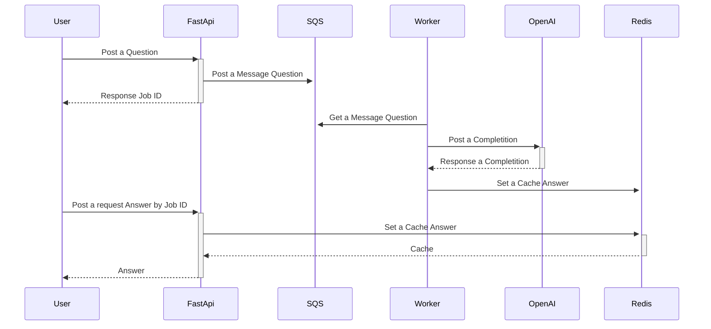
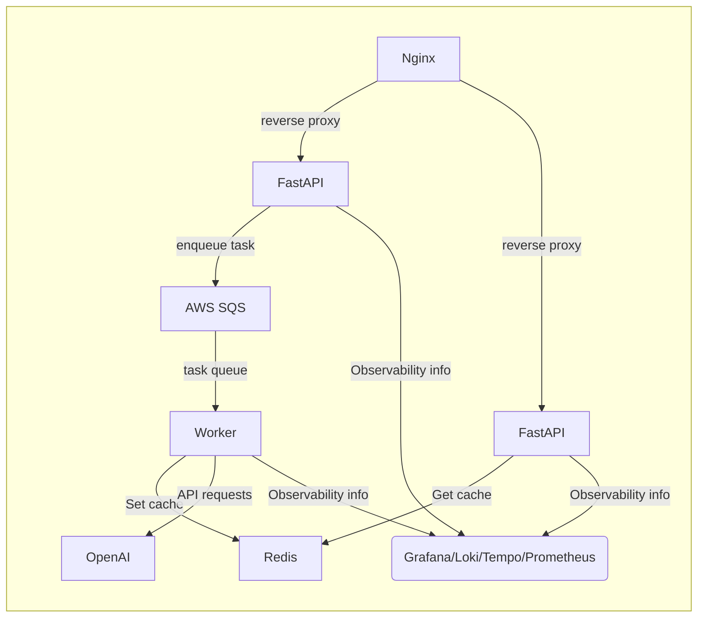

# sqs_worker_exemple
Exemplo de uso de AWS-SQS para realizar uma pergunta a openai de forma assincrona.

## Diagrama de Sequencia


## Diagrama de Arquitetura


## Como rodar o projeto
1. Algumas configurações devem ser observadas. Verifique o arquivo Readme.md de cada serviço. Para simular a AWS localmente foi utilizado o [LocalStak](https://www.localstack.cloud/). Após isso, execute o comando abaixo.
```bash
docker-compose up --build
```

## Tecnologias
- FastAPI
- Redis
- OpenAI
- AWS SQS
- Docker
- Docker Compose
- Nginx
- OpenTelemetry
- Grafana
- Loki
- Tempo
- Prometheus
- Localstack

## Estrura do Projeto
```
.
├── README.md
├── .gitignore
├── LICENSE
├── docker-compose.yml
├── app --> FastAPI
│   ├── README.md
│   ├── Dockerfile
│   ├── requirements.txt
│   ├── src
│   │   ├── __init__.py
│   │   ├── main.py
│   │   ├── models.py
├── worker --> Worker basico sem framework
│   ├── README.md
│   ├── Dockerfile
│   ├── requirements.txt
│   ├── .env ---> esse arquivo deve ser criado com as credenciais da OpenAI
│   ├── src
│   │   ├── __init__.py
│   │   ├── main.py
├── services_config
│   ├── aws_localstack
│   │   ├── create_sqs.sh --> cria a fila no localstack
│   ├── nginx
│   │   ├── etc
│   │   │   ├── nginex.conf --> configuração do nginx


